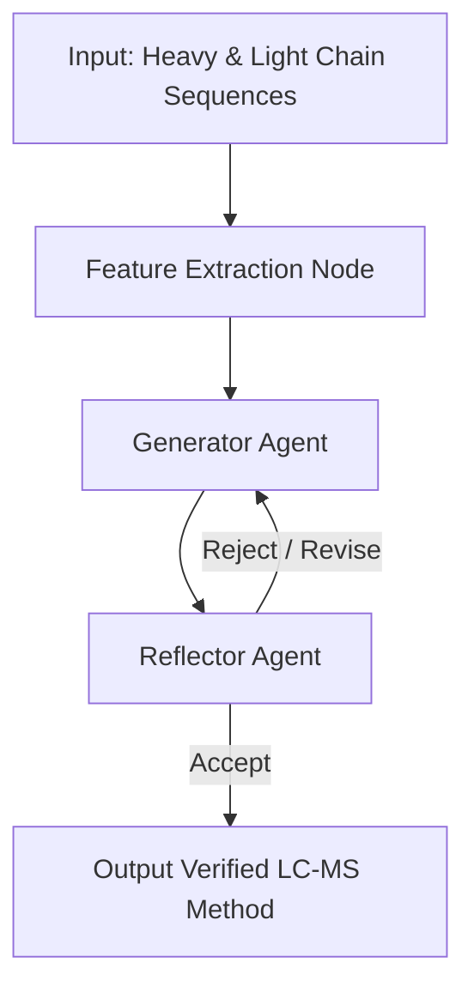

# Multi-Agent LC-MS Wet-Lab Copilot

This project is a multi-agent system built using **LangGraph** to assist biomanufacturing scientists with optimizing Liquid Chromatography-Mass Spectrometry (LC-MS) settings for complex biotherapeutics, specifically bispecific antibodies (bsAbs).

The system integrates deterministic bioinformatics tools with local Large Language Models (via Ollama) to design, critique, and refine physical experimental parameters before physical execution in the wet lab.

## 🏗️ Architecture & Workflow

The system utilizes a cyclic graph architecture inspired by recent autonomous science papers (*Co-Scientist* and *Robin*). Rather than a simple linear prompt, the AI agents act as peers in a debate loop, governed by deterministic physics.



### Component Breakdown

1.  **The State (Shared Memory):** LangGraph utilizes a `TypedDict` to pass data between steps. This state holds the raw amino acid sequences, the extracted molecular physics, the current JSON method settings, and an iteration counter.
2.  **Feature Extraction Node (Deterministic Tool):** Instead of relying on an LLM to guess molecular properties, this Python-native node uses `Biopython` to programmatically calculate the molecular weight, isoelectric point (pI), and locate N-linked glycosylation sequons. It passes these hard facts to the LLMs.
3.  **Generator Agent:** Acts as the experimental designer. It takes the biophysical facts and writes a proposed set of LC-MS settings (Column chemistry, gradients, cone voltage) formatted strictly as a JSON object using Pydantic schemas.
4.  **Reflector Agent:** Acts as the senior analytical chemist. It reviews the Generator's proposed method against a set of strict physical boundaries (e.g., preventing sialic acid shear by flagging high cone voltages, preventing irreversible binding by rejecting C18 columns for intact proteins).
5.  **The Router:** A conditional logic gate that evaluates the Reflector's decision. If the method is flawed, it routes the state back to the Generator with the specific critique. If it passes, the graph concludes.

## ⚙️ Prerequisites and Installation

This system is designed to run entirely locally, keeping proprietary biotherapeutic sequences on-premise.

### 1. Install Ollama and Local Models
Download and run [Ollama](https://ollama.com/), then pull a local instruction model via your terminal:
```bash
# Recommended for structured output reliability
ollama pull llama3:8b 
```

### 2. Python Environment Setup
Ensure you are using Python 3.10+ and install the required dependencies:
```bash
pip install langgraph langchain-ollama pydantic biopython
```
